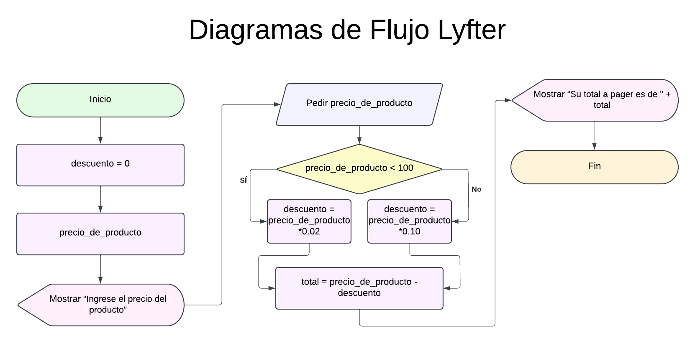
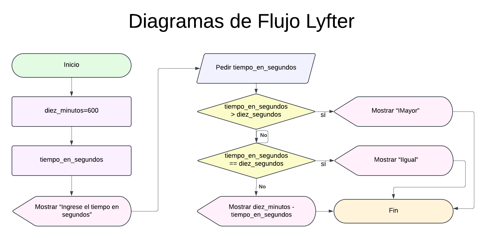
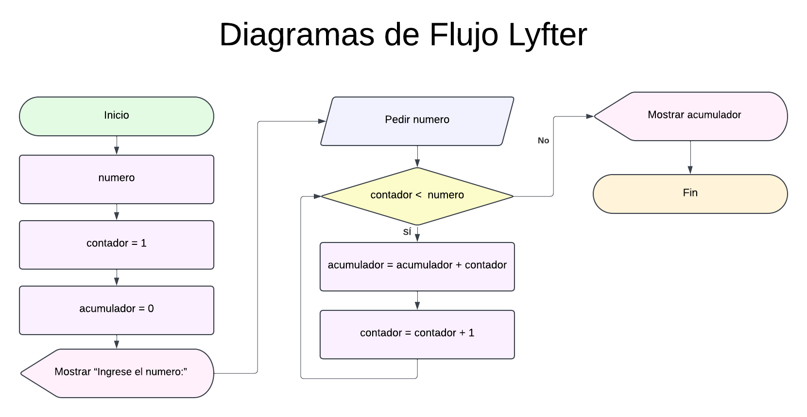
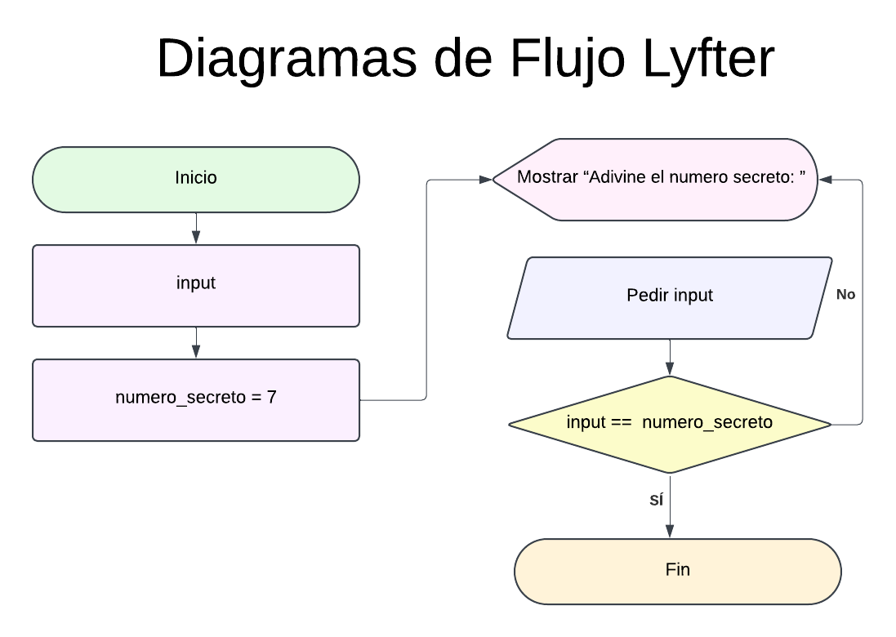
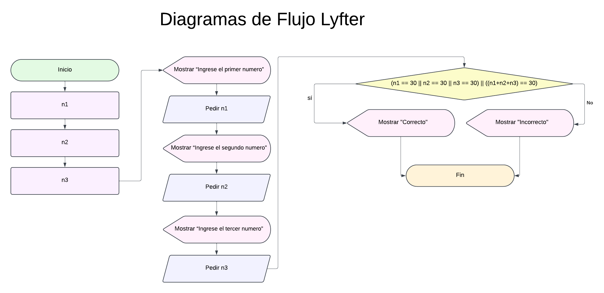

<aside>
💪🏽 **Ejercicios**

1. Cree diagramas de flujo de los [Ejercicios de Pseudocódigo](https://www.notion.so/Ejercicios-de-Pseudoc-digo-8626a7a9b3d54e5ca185e1b01aa3546f?pvs=21) previamente creados.







1. Cree un diagrama de flujo que tenga un numero secreto del 1 al 10, y le pida al usuario adivinar ese número. El algoritmo no debe terminar hasta que el usuario adivine el numero.



1. Cree un diagrama de flujo que pida 3 números al usuario. Si uno de esos números es 30, o si los 3 sumados dan 30, mostrar “*Correcto*”. Sino, mostrar “*incorrecto*”.
    1. *Ejemplos*:
        1. 23, 30, 768 → Correcto (hay un 30)
        2. 10, 15, 5 → Correcto (10 + 15 + 5 = 30)
        3. 35, 56, 2 → Incorrecto (no hay ningún 30, y la suma de ellos tampoco da 30)



</aside>


# 💪🏽 Ejercicios

## 1. Usar la función `print()` para mostrar distintos textos en pantalla

```python
def printMessage(message):
    print(message)
```

## 2. Usar la función `print()` para mostrar resultados de operaciones matemáticas básicas

**Ejemplos:**  
- 1 + 1 → 2  
- 90 + 430 → 520  
- 4 * 5 → 20

```python
print(1 + 1)
print(90 + 430)
print(4 * 5)